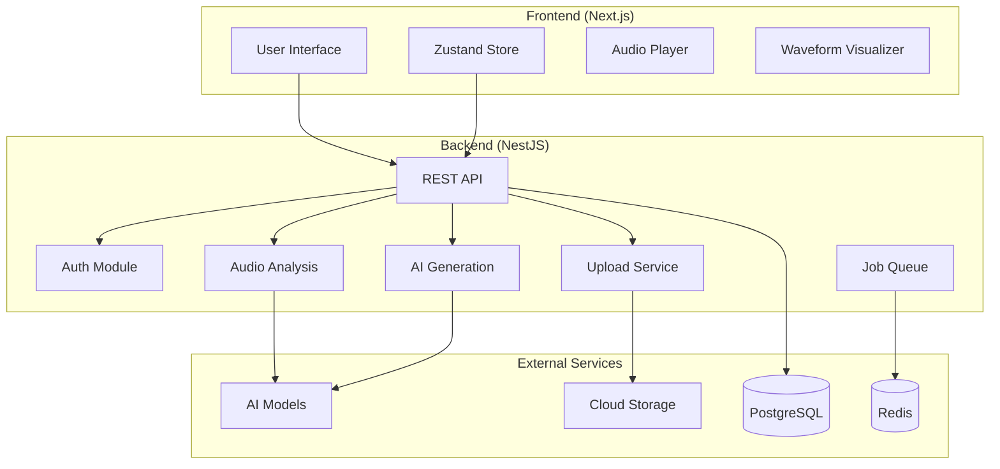

# Design Document

## Overview

Marshapp is architected as a modern, cloud-native AI music generation platform built with Next.js frontend and NestJS backend. The system leverages external AI services for music generation while maintaining a clean separation of concerns through microservice-inspired modules. The architecture prioritizes scalability, maintainability, and optimal user experience through asynchronous processing and real-time updates.

## Architecture

### High-Level Architecture



### Technology Stack

**Frontend:**

- Next.js 14 with App Router and TypeScript
- TailwindCSS for styling and responsive design
- Zustand for client-side state management
- WaveSurfer.js for audio waveform visualization
- Framer Motion for smooth animations and transitions

**Backend:**

- NestJS with TypeScript for API and business logic
- PostgreSQL with pgvector for data storage and embeddings
- Redis with BullMQ for job queue management
- Supabase Storage for file management
- NextAuth.js for authentication

**AI & External Services:**

- MusicGen via Hugging Face/Replicate for beat generation
- Stable Audio for alternative generation models
- OpenAI API for natural language prompt interpretation
- Demucs for stem separation

## Components and Interfaces

### Frontend Components

#### Core UI Components

```typescript
// Upload Interface
interface UploadComponent {
  onFileSelect: (file: File) => void;
  uploadProgress: number;
  isUploading: boolean;
  supportedFormats: string[];
}

// Generation Interface
interface GenerationComponent {
  audioFile: AudioFile;
  onGenerate: () => void;
  generationStatus: JobStatus;
  estimatedTime: number;
}

// Refinement Interface
interface RefinementComponent {
  currentBeat: GeneratedBeat;
  onPromptSubmit: (prompt: string) => void;
  promptHistory: PromptEntry[];
}

// Audio Player
interface AudioPlayerComponent {
  audioUrl: string;
  waveformData: WaveformData;
  onPlay: () => void;
  onPause: () => void;
  currentTime: number;
  duration: number;
}
```

#### State Management (Zustand)

```typescript
interface AppState {
  // User session
  user: User | null;
  isAuthenticated: boolean;

  // Upload state
  currentUpload: UploadState;
  uploadHistory: Upload[];

  // Generation state
  activeGeneration: GenerationJob | null;
  generationQueue: GenerationJob[];

  // Audio playback
  currentTrack: AudioTrack | null;
  isPlaying: boolean;
  playbackPosition: number;

  // UI state
  activeView: 'upload' | 'generate' | 'refine' | 'library';
  notifications: Notification[];
}
```

### Backend Modules

#### API Layer (NestJS)

```typescript
// Upload Controller
@Controller('uploads')
export class UploadController {
  @Post()
  async uploadFile(@UploadedFile() file: Express.Multer.File): Promise<UploadResponse>;

  @Get(':id/analysis')
  async getAnalysis(@Param('id') id: string): Promise<AudioAnalysis>;
}

// Generation Controller
@Controller('generations')
export class GenerationController {
  @Post()
  async generateBeat(@Body() request: GenerationRequest): Promise<JobResponse>;

  @Get(':id/status')
  async getStatus(@Param('id') id: string): Promise<JobStatus>;

  @Post(':id/refine')
  async refineBeat(@Param('id') id: string, @Body() prompt: PromptRequest): Promise<JobResponse>;
}

// Audio Controller
@Controller('audio')
export class AudioController {
  @Get(':id/stream')
  async streamAudio(@Param('id') id: string, @Res() response: Response): Promise<void>;

  @Get(':id/download')
  async downloadAudio(@Param('id') id: string, @Query('format') format: string): Promise<StreamableFile>;
}
```

#### Service Layer

```typescript
// Audio Analysis Service
@Injectable()
export class AudioAnalysisService {
  async analyzeAudio(fileUrl: string): Promise<AudioAnalysis>;
  async extractStems(fileUrl: string): Promise<StemData>;
  async detectTempo(audioBuffer: Buffer): Promise<number>;
  async identifyKey(audioBuffer: Buffer): Promise<string>;
}

// AI Generation Service
@Injectable()
export class AIGenerationService {
  async generateBeat(
    analysis: AudioAnalysis,
    options: GenerationOptions
  ): Promise<string>;
  async refineBeat(beatUrl: string, prompt: string): Promise<string>;
  async interpretPrompt(prompt: string): Promise<AudioModifications>;
}

// Job Queue Service
@Injectable()
export class JobQueueService {
  async addGenerationJob(jobData: GenerationJobData): Promise<string>;
  async getJobStatus(jobId: string): Promise<JobStatus>;
  async processGenerationQueue(): Promise<void>;
}
```

## Data Models

### Database Schema (PostgreSQL)

```sql
-- Users table
CREATE TABLE users (
  id UUID PRIMARY KEY DEFAULT gen_random_uuid(),
  email VARCHAR(255) UNIQUE NOT NULL,
  name VARCHAR(255),
  created_at TIMESTAMP DEFAULT NOW(),
  updated_at TIMESTAMP DEFAULT NOW()
);

-- Uploads table
CREATE TABLE uploads (
  id UUID PRIMARY KEY DEFAULT gen_random_uuid(),
  user_id UUID REFERENCES users(id) ON DELETE CASCADE,
  filename VARCHAR(255) NOT NULL,
  original_name VARCHAR(255) NOT NULL,
  file_size INTEGER NOT NULL,
  mime_type VARCHAR(100) NOT NULL,
  storage_url TEXT NOT NULL,
  status VARCHAR(50) DEFAULT 'uploaded',
  created_at TIMESTAMP DEFAULT NOW()
);

-- Audio analysis table
CREATE TABLE audio_analyses (
  id UUID PRIMARY KEY DEFAULT gen_random_uuid(),
  upload_id UUID REFERENCES uploads(id) ON DELETE CASCADE,
  tempo DECIMAL(5,2),
  key VARCHAR(10),
  genre VARCHAR(100),
  mood VARCHAR(100),
  duration DECIMAL(10,3),
  stems_data JSONB,
  metadata JSONB,
  created_at TIMESTAMP DEFAULT NOW()
);

-- Generations table
CREATE TABLE generations (
  id UUID PRIMARY KEY DEFAULT gen_random_uuid(),
  user_id UUID REFERENCES users(id) ON DELETE CASCADE,
  upload_id UUID REFERENCES uploads(id) ON DELETE CASCADE,
  job_id VARCHAR(255) UNIQUE NOT NULL,
  status VARCHAR(50) DEFAULT 'queued',
  ai_model VARCHAR(100) NOT NULL,
  generation_params JSONB,
  result_url TEXT,
  error_message TEXT,
  started_at TIMESTAMP,
  completed_at TIMESTAMP,
  created_at TIMESTAMP DEFAULT NOW()
);

-- Prompts table
CREATE TABLE prompts (
  id UUID PRIMARY KEY DEFAULT gen_random_uuid(),
  generation_id UUID REFERENCES generations(id) ON DELETE CASCADE,
  user_id UUID REFERENCES users(id) ON DELETE CASCADE,
  prompt_text TEXT NOT NULL,
  interpreted_params JSONB,
  result_url TEXT,
  status VARCHAR(50) DEFAULT 'processing',
  created_at TIMESTAMP DEFAULT NOW()
);

-- Audio versions table (for tracking refinements)
CREATE TABLE audio_versions (
  id UUID PRIMARY KEY DEFAULT gen_random_uuid(),
  generation_id UUID REFERENCES generations(id) ON DELETE CASCADE,
  prompt_id UUID REFERENCES prompts(id),
  version_number INTEGER NOT NULL,
  audio_url TEXT NOT NULL,
  waveform_data JSONB,
  is_current BOOLEAN DEFAULT false,
  created_at TIMESTAMP DEFAULT NOW()
);

-- Indexes for performance
CREATE INDEX idx_uploads_user_id ON uploads(user_id);
CREATE INDEX idx_generations_user_id ON generations(user_id);
CREATE INDEX idx_generations_status ON generations(status);
CREATE INDEX idx_prompts_generation_id ON prompts(generation_id);
CREATE INDEX idx_audio_versions_generation_id ON audio_versions(generation_id);
```

### TypeScript Interfaces

```typescript
interface User {
  id: string;
  email: string;
  name?: string;
  createdAt: Date;
  updatedAt: Date;
}

interface Upload {
  id: string;
  userId: string;
  filename: string;
  originalName: string;
  fileSize: number;
  mimeType: string;
  storageUrl: string;
  status: 'uploaded' | 'analyzing' | 'analyzed' | 'failed';
  createdAt: Date;
}

interface AudioAnalysis {
  id: string;
  uploadId: string;
  tempo?: number;
  key?: string;
  genre?: string;
  mood?: string;
  duration: number;
  stemsData?: StemData;
  metadata?: Record<string, any>;
  createdAt: Date;
}

interface Generation {
  id: string;
  userId: string;
  uploadId: string;
  jobId: string;
  status: 'queued' | 'processing' | 'completed' | 'failed';
  aiModel: string;
  generationParams: GenerationParams;
  resultUrl?: string;
  errorMessage?: string;
  startedAt?: Date;
  completedAt?: Date;
  createdAt: Date;
}

interface Prompt {
  id: string;
  generationId: string;
  userId: string;
  promptText: string;
  interpretedParams?: AudioModifications;
  resultUrl?: string;
  status: 'processing' | 'completed' | 'failed';
  createdAt: Date;
}

interface AudioVersion {
  id: string;
  generationId: string;
  promptId?: string;
  versionNumber: number;
  audioUrl: string;
  waveformData?: WaveformData;
  isCurrent: boolean;
  createdAt: Date;
}
```

## Error Handling

### Frontend Error Handling

```typescript
// Global error boundary for React components
class ErrorBoundary extends Component {
  handleError(error: Error, errorInfo: ErrorInfo): void;
  render(): ReactNode;
}

// API error handling with retry logic
class APIClient {
  async request<T>(config: RequestConfig): Promise<T>;
  private handleRetry(error: APIError): Promise<void>;
  private handleRateLimit(retryAfter: number): Promise<void>;
}

// Upload error handling
interface UploadErrorHandler {
  handleFileSizeError(maxSize: number): void;
  handleFormatError(supportedFormats: string[]): void;
  handleNetworkError(): void;
}
```

### Backend Error Handling

```typescript
// Global exception filter
@Catch()
export class GlobalExceptionFilter implements ExceptionFilter {
  catch(exception: unknown, host: ArgumentsHost): void;
}

// AI service error handling
@Injectable()
export class AIServiceErrorHandler {
  handleRateLimitError(service: string): Promise<void>;
  handleModelUnavailableError(): Promise<void>;
  handleGenerationTimeoutError(): Promise<void>;
}

// Job queue error handling
@Injectable()
export class JobErrorHandler {
  handleJobFailure(job: Job, error: Error): Promise<void>;
  retryJob(job: Job): Promise<void>;
  moveToDeadLetter(job: Job): Promise<void>;
}
```

## Testing Strategy

### Frontend Testing

```typescript
// Component testing with React Testing Library
describe('UploadComponent', () => {
  test('should handle file selection');
  test('should display upload progress');
  test('should show error for invalid files');
});

// Integration testing for audio player
describe('AudioPlayer Integration', () => {
  test('should load and play audio files');
  test('should sync waveform with playback');
  test('should handle playback errors gracefully');
});

// E2E testing with Playwright
describe('Complete Generation Flow', () => {
  test('user can upload, generate, and refine beats');
  test('user can download generated audio');
});
```

### Backend Testing

```typescript
// Unit testing for services
describe('AudioAnalysisService', () => {
  test('should extract tempo from audio file');
  test('should handle corrupted audio files');
  test('should timeout on oversized files');
});

// Integration testing for AI services
describe('AI Generation Integration', () => {
  test('should generate beat from analysis data');
  test('should handle API rate limits');
  test('should retry failed generations');
});

// API endpoint testing
describe('Generation API', () => {
  test('POST /generations should create job');
  test('GET /generations/:id/status should return job status');
  test('should require authentication');
});
```

### Performance Testing

```typescript
// Load testing for file uploads
describe('Upload Performance', () => {
  test('should handle 100 concurrent uploads');
  test('should maintain response times under load');
});

// AI service performance testing
describe('Generation Performance', () => {
  test('should complete generation within SLA');
  test('should handle queue backlog efficiently');
});
```

## Security Considerations

### Authentication & Authorization

- JWT-based authentication with refresh tokens
- Role-based access control for admin features
- Rate limiting per user and IP address
- Secure session management with httpOnly cookies

### File Upload Security

- File type validation and sanitization
- Virus scanning for uploaded files
- Size limits and quota management
- Secure file storage with signed URLs

### API Security

- Input validation and sanitization
- SQL injection prevention with parameterized queries
- CORS configuration for frontend domains
- API key management for external services

### Data Protection

- Encryption at rest for sensitive data
- HTTPS enforcement for all communications
- Regular security audits and dependency updates
- GDPR compliance for user data handling
